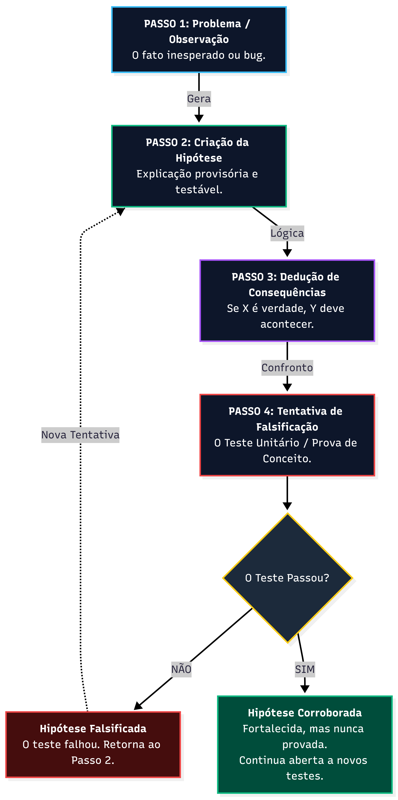

# Popper no Sofware, um Erro que da Certo.
> Autor: Éderson Padovani
## Uma Filosofia para a Excelência

---

## Introdução: A Ciência de Estar Errado

!!! quote "Mantra"
    "Errar rapidamente é evoluir rapidamente."

No desenvolvimento de software, apesar de nem sempre explícito, existe um processo científico em ação. Pense na decisão de usar uma biblioteca existente versus construir uma solução do zero. Um cientista, antes de iniciar um experimento, primeiro mergulha na literatura existente. Se a pesquisa já foi feita, ele a utiliza como base para evoluir. Se não, ele cria algo novo. O desenvolvedor é, em sua essência, um pesquisador científico: não importa o quanto já foi criado, seu trabalho sempre será fazer diferente, usando ou não a "ciência" já existente.

Ainda assim, em nossa cultura, o erro é frequentemente visto como um fracasso, um sinal de incompetência ou um resultado a ser evitado a todo custo. E se, em vez de temer o erro, nós o abraçássemos como a ferramenta mais poderosa para a descoberta e a inovação?

!!! abstract "O Método Hipotético-Dedutivo"
    Essa ideia não é nova. Ela é a espinha dorsal do método científico moderno, formalizada pelo filósofo **Karl Popper** [^1]. Ele argumentou que o que separa a ciência da pseudociência não é a capacidade de uma teoria ser provada como "verdadeira" (algo que ele considerava logicamente impossível), mas sim sua capacidade de ser provada como **falsa**. É um processo contínuo de conjecturas ousadas e tentativas rigorosas de refutá-las.

Entender este método é fundamental para adotar uma mentalidade onde cada bug, cada teste que falha e cada hipótese descartada não é um passo para trás, mas um salto monumental em direção a uma solução mais robusta, resiliente e, em última análise, correta.

---

## Dissecando o Método: O Ciclo da Descoberta

{ width="400" style="display: block; margin: 0 auto" }
*Figura 1: O ciclo iterativo de descoberta e falsificação.*

1. **O Ponto de Partida: O Problema**
    Tudo começa com a curiosidade ou a frustração. Um bug que não deveria existir, um resultado de um algoritmo que não faz sentido, uma observação que contradiz o que sabemos. Este é o motor da ciência. Sem um problema claro, não há direção para a investigação.

2. **A Centelha Criativa: A Hipótese**
    A hipótese é um palpite educado, uma solução potencial. Mas não qualquer palpite. Uma hipótese científica deve ser, acima de tudo, **falsificável**. Isso significa que deve ser possível conceber um experimento ou uma observação que possa prová-la errada.
    * *Hipótese inútil:* "O sistema está lento por causa de magia."
    * *Hipótese útil:* "O sistema está lento devido a um gargalo de I/O no banco de dados." (Podemos testar e refutar isso).

3. **O Raciocínio Lógico: A Dedução**
    A partir da hipótese geral, deduzimos previsões específicas. É o momento *"se..., então..."*.
    > "Se o gargalo é no banco de dados, então, ao otimizar a query X, o tempo de resposta deve diminuir em 50%".
    
    Essas deduções transformam uma ideia abstrata em um resultado concreto e mensurável.

4. **O Confronto com a Realidade: A Falsificação**
    Este é o coração do método. Criamos um experimento (um teste unitário, um teste de carga, um protótipo) não para ver nossa hipótese brilhar, mas para tentar derrubá-la com toda a nossa força. Um cientista (ou engenheiro) honesto não busca confirmação, busca a crítica mais dura: a da própria realidade.

5. **O Ciclo de Evolução: Falsificação vs. Corroboração**
    * Se a previsão falha, a hipótese é **falsificada**. Isso é um sucesso! Aprendemos algo valioso e podemos formular uma hipótese melhor.
    * Se a previsão se confirma, a hipótese é **corroborada**. Ela não foi "provada", mas sobreviveu a uma tentativa de assassinato e, por isso, ganhou nossa confiança até o próximo teste. O conhecimento avança eliminando o que é falso, não provando o que é verdadeiro.

---

## Eu Contra Mim Mesmo: A Batalha Contra o Viés

O método hipotético-dedutivo é logicamente impecável. Sua maior vulnerabilidade, no entanto, não está em seus passos, mas em quem os executa: nós. Como nos mostra o psicólogo e Nobel de Economia **Daniel Kahneman** [^2], nossa mente é um campo minado de vieses cognitivos. A batalha mais difícil não é contra a complexidade do código, mas contra as armadilhas da nossa própria mente.

!!! danger "O Grande Inimigo: Viés de Confirmação"
    A tendência natural de buscar, interpretar e favorecer informações que confirmam nossas crenças. Quando você cria uma hipótese sobre seu próprio código, seu cérebro *quer* que ela esteja certa. Ele o impulsionará a escrever testes "amigáveis", a ignorar casos de borda e a interpretar resultados ambíguos de forma favorável.

### A Armadilha do Entusiasmo: A Paixão como Ponto Cego
Muitas vezes, o desenvolvedor é vítima do próprio entusiasmo. O anúncio de uma nova tecnologia, biblioteca ou framework pode gerar uma paixão avassaladora. Sem conhecer a fundo o assunto, entender o contexto real do projeto ou, principalmente, usando a vontade de aprender algo novo como uma muleta para a decisão, o desenvolvedor cai em armadilhas. Essas não são os erros produtivos do método científico, mas decisões fatais que podem matar um projeto.

Esses são erros "no básico". É como um cientista que decide usar um equipamento inadequado para um experimento crucial apenas por ser novidade. Segurar o entusiasmo e ter a sensatez de ofertar algo para o projeto com base na necessidade, e não na vontade, é essencial.

### Divorciando-se do Ego: Sua Criação Não é Você
O código que você escreve é uma extensão do seu raciocínio, mas ele não é você. A filosofia do falseamento exige um divórcio brutal do ego. O valor de um desenvolvedor nesta cultura não está em "estar certo" na primeira tentativa, mas em sua capacidade de criar os experimentos mais cruéis e honestos para provar a si mesmo que está errado.

Práticas como **revisões de código (code reviews)** são a institucionalização do falseamento: convidamos nossos pares para tentarem refutar a hipótese de que "este código é a melhor solução". Neste processo, o criador é apenas a fonte do experimento. Sua opinião, sua intuição, seu "achar" que algo funciona, tudo isso é irrelevante.

### Os Dados São a Única Verdade
Se a opinião do criador é irrelevante, o que é relevante? **Os dados.** O log de erro. O teste de integração que falha. A métrica de performance que despenca sob carga. Estes são os porta-vozes imparciais da realidade.

> "A 'verdade' de um sistema não reside na mente de quem o criou, mas nos resultados dos testes que tentaram destruí-lo."

Aceitar um resultado que contradiz brutalmente sua expectativa não é um fracasso pessoal; é o ápice da disciplina científica.

---

## Por que Errar te Faz Melhor?

Após aceitar a verdade dos fatos sem negociar com o erro que cometemos, entramos no cerne da evolução. Por que essa abordagem funciona e acelera nosso desenvolvimento? A resposta é simples: a evolução humana se dá sobre a premissa do erro. Tentar, falhar e aprender com a falha é a base do nosso conhecimento.

O filósofo e investidor **Nassim Nicholas Taleb** [^3] cunhou o termo **Antifrágil** para descrever sistemas que se beneficiam do caos e dos erros. Ao abraçar o erro, transformamos nosso processo de frágil para antifrágil. Usar o erro para evitar o desacerto futuro deu origem à própria História.

### A Anatomia da Senioridade
Como alguém se torna um especialista em desenvolvimento? Começa como Júnior, evolui para Pleno, depois Sênior e, finalmente, especialista. O que realmente difere essas posições? **O volume de erros.**

Quanto menos você precisa cometer um erro *agora*, melhor você fica. Isso acontece porque um Sênior ou especialista já errou muito no passado e, crucialmente, aprendeu com cada falha. A experiência não é uma medida de tempo, mas uma medida de erros processados e lições internalizadas. Um Sênior tem uma tolerância menor ao erro não por ser perfeito, mas porque seu "banco de dados" de falhas passadas o alerta para os perigos antes que eles se concretizem.

### Aceleração Exponencial: Errar Rápido, Aprender Rápido
É fundamental entender: não estamos glorificando o erro, mas sim o **aprendizado** com o erro. Esta ideia é o motor por trás das metodologias ágeis e do movimento *Lean Startup* de **Eric Ries** [^4], com seu ciclo **Construir-Medir-Aprender**.

O objetivo é diminuir o tempo de ciclo de uma ideia à sua validação (ou invalidação). Se você errar mais rápido, você evolui mais rápido. Vemos desenvolvedores atingirem a senioridade em um ou dois anos. Qual é o diferencial exponencial deles? A capacidade de errar, identificar a causa e corrigir em um ciclo extremamente curto.

---

## Da Filosofia à Prática: Ferramentas de Falsificação

Como essa filosofia se traduz em ações concretas no dia a dia do desenvolvimento de software? O método hipotético-dedutivo não é apenas uma teoria abstrata; ele está embutido em algumas de nossas práticas de engenharia mais eficazes.

1.  **Test-Driven Development (TDD)**
    O TDD é a aplicação mais pura do método de Popper. Você começa escrevendo um teste que falha (Tentativa de Falsificação para uma funcionalidade inexistente). Esta é sua hipótese refutada. Em seguida, você escreve o mínimo de código para fazer o teste passar. O ciclo se repete, construindo um sistema corroborado a cada passo.

2.  **Prototipagem e MVPs**
    Um Mínimo Produto Viável (MVP) não é uma versão barata do produto final. É um experimento para testar a hipótese mais arriscada de um negócio (*"As pessoas querem isso?"*). Seu propósito primário é obter dados para refutar ou corroborar a visão do produto o mais rápido possível.

3.  **Monitoramento e Alertas (Observability)**
    Um sistema de observabilidade robusto é uma máquina de falsificação contínua. Cada log de erro, cada métrica que desvia do esperado, é a realidade refutando a hipótese de que "o sistema está funcionando perfeitamente". Ele nos força a confrontar problemas antes que eles se tornem catástrofes.

---

## Qual o Limite do Erro?

Se abraçamos o erro como ferramenta, precisamos definir seus limites. O objetivo não é o glamour do caos, mas a disciplina da construção robusta. O software está bom o suficiente? Ele é perfeito?

Não. Nada é perfeito, e a própria metodologia hipotético-dedutiva afirma isso. A ciência não busca a verdade final e imutável, mas a melhor explicação que temos até o momento. Nossa busca no desenvolvimento não é pela perfeição, que é inatingível, mas por um critério muito mais poderoso e pragmático: a **excelência**.

### Definindo a Excelência: A Verdadeira Linha de Chegada
Quando um software está pronto para a produção? A resposta raramente é técnica. O que é "bom" para o desenvolvedor (código elegante, arquitetura pura) não é necessariamente "bom" para o cliente. A linha de chegada é definida pela excelência, e a excelência é o ato de cumprir e superar as expectativas.

!!! success "Definição de Excelência"
    Excelência é a entrega de uma solução que atende a todas as definições previamente acordadas e, idealmente, vai além. Se você, através do ciclo de criar hipóteses, testá-las brutalmente e aceitar os erros, conseguiu construir algo que atinge esse nível de alinhamento com a necessidade do cliente, você alcançou a "perfeição" prática.

Essa "perfeição" não significa que o código é isento de bugs. Significa que construímos a solução mais provável de ter sucesso no mundo real. Esse é o limite do erro: ele termina onde a excelência começa.

---

## E se Tudo Isso for Besteira?

O uso de um método científico como filosofia pode não ser visto positivamente por todos. É uma contracultura que desafia a ideia de que somos pagos para "acertar de primeira".

Por outro lado, todos nós sabemos que nunca seremos capazes do acerto definitivo. Então, o que nos sobra? Os erros. Eles nos evoluem. Já parou para pensar no que é um **update** de software? É a mais pura e simples correção de erros e o aprimoramento de hipóteses falhas da versão anterior. O erro nos alimenta de dados para o acerto.

Então a pergunta é: por que não investir no erro? Ele acelera, aprimora e nos leva à excelência. Nenhum ativo de software do mundo começou perfeito.

> "Não existe bala de prata."
> — **Fred Brooks**, *The Mythical Man-Month* [^6]

> "Falar é fácil. Mostre-me o código."
> — **Linus Torvalds**

Então, vamos abraçar o erro como nossa principal ferramenta para a excelência.

---

## Referências Bibliográficas

[^1]: Popper, Karl. *A Lógica da Pesquisa Científica*.
[^2]: Kahneman, Daniel. *Rápido e Devagar: Duas Formas de Pensar*.
[^3]: Taleb, Nassim Nicholas. *Antifrágil: Coisas que se Beneficiam com o Caos*.
[^4]: Ries, Eric. *A Startup Enxuta (The Lean Startup)*.
[^5]: Schulz, Kathryn. *A Arte de Estar Errado (Being Wrong)*.
[^6]: Brooks, Fred. *The Mythical Man-Month*.